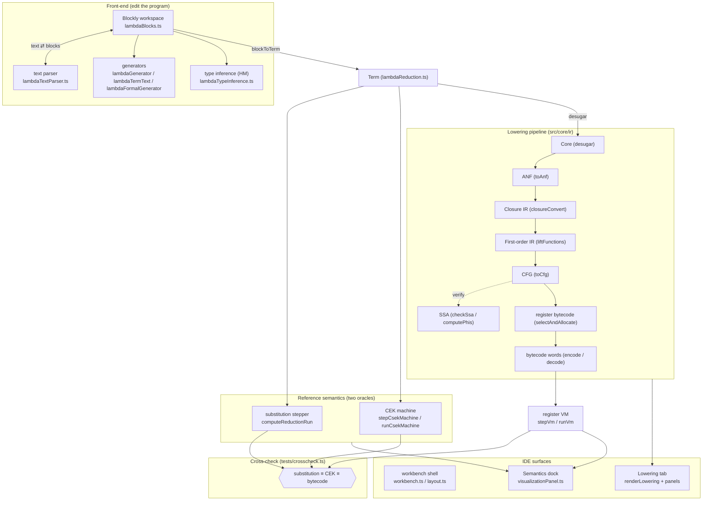

# Block Lambda Calculus — Architecture

*Last updated: 2026-07-24*

This document explains the design of the Block Lambda Calculus IDE and maps
every part of it to the source tree. It is meant to be read top-to-bottom once
to build a mental model, then used as a navigation map (the [module map](#12--module-map-file-by-file)
at the end lists every file and its role).

---

## 1 · What this system is

Block Lambda Calculus is two things fused into one application:

1. **A block-based IDE** for a *simply-typed lambda calculus* — you build
   programs by connecting Blockly blocks (variable, abstraction, application,
   `let`/`letrec`, `if`, numbers, booleans, operators), with live
   Hindley-Milner type inference and a text ⇄ blocks bridge.

2. **A complete, inspectable compiler + runtime** for that language — the same
   program is lowered through nine intermediate representations
   (Term → Core → ANF → Closure IR → First-order IR → CFG → SSA → register
   assembly → bytecode), executed on a register bytecode VM, and cross-checked
   against two independent reference semantics (a substitution rewriter and a
   CEK machine).

The unifying design goal is **block-traceability**: every node in every IR, and
every instruction in the final bytecode, still points back to the Blockly block
it came from. That is what lets the IDE render each compiler stage as an
interactive Inspector tab where hovering a lowered artifact highlights its
source blocks on the canvas.

The research thesis the system executes is an **operational-correspondence
ladder**: three completely different evaluators — tree rewriting, an
environment machine, and a compiled register machine — provably agree, salient
step by salient step and on the final value, for every program.

---

## 2 · Top-level architecture



Three layers, three responsibilities:

- **Front-end** — how a program is authored, typed, and mirrored to text.
- **Semantics + pipeline** — the pure, browser-independent *language
  implementation*: two reference evaluators and the compiler. All of this is
  headless-testable (`npm test` runs it under Node with no DOM).
- **UI** — the Blockly workbench plus the Inspector/Semantics panes that render
  each stage and let you drive the machines by hand.

The pure core (`src/core/{ir,semantics,machine,type-inference}`) never imports
from `src/core/ui` or the DOM — the dependency arrow always points *from* UI
*into* the core, never back.

---

## 3 · The language and its two evaluation strategies

The source term is **`Term`** (`src/core/semantics/lambdaReduction.ts`): a
discriminated union of `var`/`abs`/`app`/`let`/`letrec`/`fix`/`num`/`bool`/
`numop`/`boolop`/`cmpop`/`if`/`hole`. `blockToTerm(block)` reads the real
Blockly block tree into a `Term`; every `Term` node carries `sourceId`/
`sourceAliases` (the block ids it came from) — this is the root of the
provenance thread.

The only numeric type is `int`, so `÷` is **integer division truncating toward
zero**, and division by zero yields `0` (keeping a well-typed `int` term an
integer). This is enforced identically in every evaluator.

Two evaluation strategies run throughout the whole system, selected by
`ReductionKind = 'structure' | 'value'`:

- **Call-by-Structure (CbS, the language default)** — β substitutes the
  *unevaluated argument's block structure* into each occurrence of the
  parameter as independent copies; each use-site reduces its own copy, so
  duplicated work is visible as duplicated structure. `(λx. x + x) (3 * 7)`
  computes `3 * 7` **twice**.
- **Call-by-Value (CbV)** — the argument is reduced first, then substituted;
  the work is done **once**.

Neither strategy reduces under a binder (a lambda is a value; its body reduces
only after an application). The **`(λx. x + x) (3 * 7)` prim-count signature**
(two `*` under CbS, one under CbV) is pinned as a test at *every* stage of the
pipeline — it is the canary that the strategy distinction survives lowering.

---

## 4 · Front-end (authoring)

| Concern | File | Notes |
|---|---|---|
| Block definitions | `src/core/blocks/lambdaBlocks.ts` | 12 custom Lambda blocks; name fields validated against the parser so every program stays text-convertible. |
| Text ⇄ blocks | `src/core/parser/lambdaTextParser.ts` | `parseLambdaTextToWorkspaceState(text)` parses `\x. x` / `λx. x` source into a Blockly workspace state; `isValidLambdaName` is the shared identifier rule. |
| Blocks → text | `src/core/generator/lambdaGenerator.ts`, `lambdaTermText.ts` | `generateLambdaCode` with optional type annotations; `lambdaTermText` is the inline one-liner form. |
| Typing derivation | `src/core/generator/lambdaFormalGenerator.ts` | Renders a natural-deduction-style typing derivation (`{ html, text }`). |
| Type inference | `src/core/type-inference/lambdaTypeInference.ts` | Hindley-Milner: fresh vars for λ params, arrow inference for abs/app, let-polymorphism via generalized schemes, monomorphic `letrec`, `int`/`bool` checking. Produces a `LambdaInferenceReport` (`blockTypes`, `blockTypesStructured`, `blockIssues`, `topLevelTypes`). |
| Inference scheduling | `src/core/type-inference/inferenceDriver.ts` | Runs inference to a fixpoint on workspace changes, incremental where possible; the IDE calls `runLambdaInferenceToFixpoint`. |

The **structured** report (`blockTypesStructured: Map<blockId, Type>`) is the
important hand-off: `desugar` consumes it so the compiler carries *real* types
rather than re-parsing formatted strings.

---

## 5 · Two reference semantics

Before any compilation, the language has two independent, executable
definitions of meaning. Both are pure functions of state, so both get exact
time-travel (a history stack) in the UI.

### 5.1 · Substitution stepper — the spec

`computeReductionRun(block, kind)` (`lambdaReduction.ts`) small-step-rewrites
the `Term` and returns a `ReductionRun`: a list of `ReductionFrame`s (each a
serialized block tree), plus `finalValue` and `normalForm`/`truncated` flags.
Each frame is tagged with a **`salient`** rule id when the step is one a machine
must also fire — `'beta'`, `'if-true'`/`'if-false'`, or `'prim <op>'`. Salient
rules are the human-visible redexes; everything else (descending into a
sub-term, administrative bookkeeping) is non-salient. This salient/non-salient
distinction is the spine of the whole correspondence story.

### 5.2 · CEK machine — an environment machine

`src/core/machine/csekMachine.ts` implements a **C**ontrol/**E**nvironment/
**K**ontinuation machine that walks the *real* block tree by id (it never copies
or mutates blocks). `stepCsekMachine(workspace, state)` is pure in the state;
`runCsekMachine` steps to completion.

- Under **CbS** the environment binds an argument as a **`Thunk` (block + env)**
  and *every variable lookup re-enters it* (no memoization) — environment
  lookup is the lazy version of CbS's physical copying, so the machine fires the
  same salient rules **in the same order** as the substitution trace.
- `isSalientRule(rule)` marks `beta`/`if-*`/`prim …` (notably **not** thunk
  `lookup`, which is administrative) — the exact set that must line up with the
  substitution trace.

The pipeline's ANF stage (§6.2) and the register VM (§7) are both *faithful
mirrors* of this machine's thunk discipline — that fidelity is why the
three-way cross-check holds.

---

## 6 · The lowering pipeline (`src/core/ir/`)

The compiler is a sequence of small **nanopasses**, each a pure function from
one IR to the next. Every IR is a separate, fully-typed data model with its own
`{ html, text }` pretty-printer, and every pass threads provenance forward. The
barrel `src/core/ir/index.ts` re-exports the whole pipeline.

```
Term ──desugar──▶ Core ──toAnf──▶ ANF ──closureConvert──▶ Closure IR
                                              │
                                     liftFunctions
                                              ▼
   bytecode ◀──encode── VmProgram ◀──selectAndAllocate── CFG ◀──toCfg── FIR
                                              ▲
                                     checkSsa / computePhis (verify)
```

### Shared infrastructure

| File | Role |
|---|---|
| `provenance.ts` | `IRProvenance` (`sourceId`/`sourceAliases`) + `withSource`/`withSources`/`provSources` — the block-traceability thread woven through every IR. |
| `types.ts` | One shared `IRType` for all stages: the source fragment (`tvar`/`tcon`/`tfun`) plus the closure-conversion target (`tprod`/`tcode`/`texists`/`tclos`), with `expandClos` and `formatIRType`. |
| `freshNames.ts` | Deterministic `t0, t1, …` name supply (stable IR, churn-free golden output). |
| `prettyPrinters.ts` | `{ html, text }` printers for **every** stage (Core/ANF/Clos/FIR/CFG/Assembly) + the shared `makeTypeFormatter`. |

### 6.1 · Core — `desugar` (`desugar.ts`, model `core.ts`)

`Term → CoreTerm`. Unifies the three operator kinds into one `prim` node with a
`PrimOpKind = 'num' | 'bool' | 'cmp'` discriminator, attaches each node's
`IRType` from the inference report (via `makeTypeLookup`), and keeps `letrec` a
*named* recursive binding (not `fix`) — because a named recursive definition is
what later becomes a liftable top-level function.

### 6.2 · ANF — `toAnfProgram` (`toAnf.ts`, model `anf.ts`)

`CoreTerm → AnfProgram`. Standard one-pass A-normalization (Flanagan et al.):
every intermediate result is `let`-bound, so the three explicit layers
(`AnfAtom` trivial operands / `AnfComp` real computations / `AnfExpr`
let-normalized expressions) make the discipline visible in the type. **This is
where the two strategies diverge and where SSA is implicitly born** (ANF's
single-assignment `let`-nesting is functional SSA):

- **CbV** — application arguments and `let`/`letrec` right-hand sides evaluate
  *before* the binding (`normalizeName`), binding strictly (`atom`/`comp`).
- **CbS** — those same three positions bind a **`susp` thunk** and every use
  becomes a **`force`** — a faithful mirror of the CEK machine's
  thunk-rebind-on-lookup. Positions the machine always forces (the function of
  an app, both prim operands, the `if` condition) bind strictly under both.

### 6.3 · Free variables — `orderedFreeVars` (`freeVars.ts`)

The analysis closure conversion needs: the *first-occurrence-ordered* free
names of an expression (excluding a supplied `bound` set of already-lifted
global labels). First-occurrence order makes the env layout deterministic.

### 6.4 · Closure IR — `closureConvert` (`closureConvert.ts`, model `clos.ts`)

`AnfProgram → ClosProgram`, **type-preserving**. Every lambda becomes an
explicit `clos { code, env }` pair; the environment type is *existentially
hidden* — `A→B = ∃γ. ((γ,A)→B) × γ` (Minamide–Morrisett–Harper). The
existential is the whole point in a block IDE: two blocks that both produce an
`int→int` closure but capture *different* variables must still have the **same**
type to fit the same socket, so `∃γ` hides the differing env. The rewrite is
local — only `lam → clos` and `app → callclos` change shape; each code body
opens with a projection preamble `let yᵢ = proj(envParam, i)`. Recursion is
handled by **known-functions-by-label** (a CbV `letrec` lambda gets an *empty*
env; the self-reference resolves to a label, not a capture).

### 6.5 · First-order IR — `toFir`/`liftFunctions` (`liftFunctions.ts`, model `fir.ts`)

`ClosProgram → FirProgram`. Lambda lifting: hoist every inline `ClosCode` into a
flat, labeled `FirProgram.functions` table, replacing `clos.code: ClosCode`
with `clos.code: Label`. That single-field change is the *only* structural delta
from the Closure IR — everything else is re-typed identically — which is why
this pass is small and mechanical. Discovery order = definition order (a closure
is lifted before its own body is walked, so outer precedes nested).

### 6.6 · CFG — `toCfg` (`toCfg.ts`, model `lir.ts`)

`FirProgram → CfgProgram`: control-flow-graph construction over **virtual
registers**. Makes the two things the register machine leaves implicit explicit:

- **Control.** An `if` becomes a `condbr` into two blocks; a `let`-bound `if`
  merges at a **join block carrying one block parameter** (the SSA join form —
  φ-nodes are the equivalent classical presentation). A `Sink` (`return | join`)
  threads the continuation so the tail and let-bound cases share one code path.
- **The heap.** A `clos`/`susp` lowers to primitive `alloc` + `loadcode` +
  `store` building the **two-object closure layout** (`[code | env]` pair + a
  separate γ tuple). A recursive `letrec` thunk is built by
  **allocate-then-backpatch** — the reason the ISA keeps primitive heap ops
  instead of a fused constructor.

The lowering is tag-driven and **strategy-agnostic**: FIR's `var` vs `force`
already encodes strict vs lazy, and `susp`/`letrec` appear only under CbS, so
`toCfg` has no strategy branch. Thunk closure-conversion (computing a `susp`
body's free names, capturing them, projecting them back at thunk entry) is the
real new work here — no earlier pass did it, since the FIR evaluator captured
the whole env chain.

### 6.7 · SSA — `checkSsa` / `computePhis` (`ssa.ts`)

**Verification, not construction.** Because ANF-shaped lowering already emits
valid SSA (Appel, *"SSA is functional programming"*), there is nothing to build
— so 3.3 is a *dominance-based verifier* plus the classical φ presentation
derived on demand:

- `checkSsa(prog)` — one definition per vreg; every use dominated by its def
  (full iterative dominators over the reachable subgraph); block-argument arity
  matching every edge; no unreachable blocks. Empty result ⇒ well-formed.
- `computePhis(func)` — the `%p = φ(v from pred, …)` view derived from block
  params + the arg each predecessor passes. Block-args stay the single source of
  truth (no drift); φ is the on-demand presentation.

### 6.8 · Register assembly — `selectAndAllocate` (`toAsm.ts`, ISA `isa.ts`)

`CfgProgram → VmProgram`: the first pass that targets the **permanent ISA**.
Three jobs: (1) **layout + instruction selection** — blocks in reverse-postorder
(valid because every CFG is acyclic: recursion is a `CallClos` to a fresh frame,
never a back-edge), each `CfgInstr` → one `Instr`, `const`s interned into a
pool, `br`/`condbr` → `Jmp`/`JmpIf` with **self-relative offsets**; (2)
**linear-scan register allocation** (Poletto–Sarkar) over `REG_COUNT = 8`
physical registers — one live interval per vreg, the ABI pinned (`env → r0`,
`arg → r1`), and if peak pressure exceeds 8, two registers are held back as
reload/spill scratch and the rest linear-scanned; (3) **calling convention as
explicit ops** — closure-invoke is an *indirect* `CallClos` (the code pointer is
read from the closure record at run time), a tail invoke is `TailCallClos`, and
a tail `force` (`Force d,x; Ret d`) is peepholed to `TailForce`.

### 6.9 · Bytecode — `encode` / `decode` (`encode.ts`)

`VmProgram ⇄ EncodedProgram`. Fixed 32-bit words `op(8)|a(8)|b(8)|c(8)`, one
per instruction. `REG_COUNT = 8` means every register fits a nibble, so `Bin`
(the one 4-operand instruction) nibble-packs its two register reads;
`Jmp`/`JmpIf` offsets round-trip through a signed byte. Provenance rides a
side-table (`EncodedProgram.provenance`), never packed into the word — keeping
the word layout a faithful "this is what the words encode" artifact rather than
a debug format. `decode(encode(prog))` is executable and behaves identically
(a round-trip property test).

---

## 7 · The register bytecode VM (`isa.ts`, `vm.ts`)

The permanent machine model, chosen deliberately (the ISA is a committed
contract):

- **Heap of records** built by primitive `Alloc`/`Store`/`Load`. The
  **two-object closure layout**: a closure/thunk is a 2-word pair
  `[ CLOS_CODE=0 | CLOS_ENV=1 ]`, `CLOS_ENV` pointing at a separate γ tuple (or
  `null`). `proj(env, i)` is `Load env, i` **offset-free** (env is the tuple,
  not the pair).
- **A thunk is a nullary closure; `force` is invoking one** — discriminated at
  run time by the code's **arity** (`CodeEntry.arity`: 0 ⇒ thunk ⇒ invoke; 1 ⇒
  a closure *value* ⇒ force is identity). No heap tagging needed. Non-memoizing,
  so the CbS copy-count signature survives.
- **Bounded per-frame register file** `r0…r7` + a spill area; per-frame
  isolation means calls never clobber the caller (no caller/callee-saved
  bookkeeping), yet a function over-pressured beyond 8 live values still spills.
- **ISA** (`Op`, ~16 opcodes): `Const/Move/Bin`, `Alloc/Load/Store/LoadCode`,
  `CallClos/TailCallClos/Force/TailForce/Ret`, `Jmp/JmpIf`, `Spill/Reload`.

**`stepVm(prog, previous)`** (`vm.ts`) is a *pure* single-step, deliberately the
same shape as `stepCsekMachine`: guard on status → clone `previous` with its
`frames`/`heap` freshly sliced → dispatch in a try/catch that turns a throw into
a `stuck` state. The purity discipline is exact — every write replaces one
`Frame`/`HeapRecord` object rather than mutating in place — so **Back is exact
time travel including heap state**, which a mutating VM would lose.
`TailCallClos`/`TailForce` overwrite the current frame (O(1) tail recursion);
`syncCount` counts the salient ops (`isSalientOp`: `CallClos`/`TailCallClos` ≈
β, `JmpIf` ≈ if, `Bin` ≈ prim) that must align with the CEK machine.

> **A subtlety the machine gets right:** `Force`/`TailForce` are **not**
> salient. Forcing a thunk is bookkeeping (it mirrors CSEK's non-salient
> `lookup` rule); only what runs *inside* the forced thunk (a `Bin`, a nested
> `CallClos`) is a reduction event. Counting `Force` would double-count every
> CbS variable use and break the correspondence.

---

## 8 · The correspondence ladder

The system's central claim is that three unrelated evaluators agree. This is
made concrete at two granularities:

- **Final value (`tests/crosscheck.ts`)** — for every program × strategy,
  `substitution ≡ CEK ≡ bytecode`, with the bytecode run through its
  *serialized* form (`decode(encode(…))`) so serialization is on the checked
  path. This is the *one test that guards the whole compiler*.
- **Salient step count / order (`syncCount`)** — the CEK machine matches the
  substitution trace **per event** (rule id + order); the register VM matches
  **per count**. They differ in exactly one characterizable way: compilation
  (ANF + closure conversion) *fixes* an evaluation order for unmemoized CbS
  thunk chains that the tree-walking machines leave open, so the VM fires the
  same *multiset* of salient events and the same final value, but the
  *interleaving* can differ (CbS recursion only). Matching the VM per-count is
  the honest invariant — matching per-event would raise false "diverged" alarms
  on programs that agree perfectly.

The **Lockstep** view (`visualizationPanel.ts`, `buildLockstep`) renders this
live: each substitution frame is paired with the CEK state *and* the VM state
that have "caught up" to it, with the running `syncCount`, and shows
`substitution ≡ CEK ≡ VM` (or a `diverged` reason).

---

## 9 · The IDE (`src/core/ui/`, `src/assets/`)

### 9.1 · Entry and workbench shell

`src/assets/js/block_lambda.ts` is the webpack entry — it injects the Blockly
workspace, registers blocks/renderer/context-menus, wires every panel, and owns
the Inspector's render cascade. `workbench.ts` organizes the shell (activity
bar, perspectives, command palette, bottom tabs, status bar); `layout.ts` +
`layoutState.ts` handle hide/show, resize, and the *validated, persisted*
layout (`block-lambda-ide-layout-v2`, defensively degrading malformed payloads
to defaults).

### 9.2 · The Inspector "Lowering" tab — the compiler made visible

`renderLowering` in `block_lambda.ts` runs the pipeline one stage further per
selected stage button and renders it. The stage strip is
`Core | ANF | Closures | First-order | CFG | Assembly | Machine code`:

| Stage | Rendered by | Treatment |
|---|---|---|
| Core / ANF / First-order | `prettyPrinters.ts` | text listings |
| Closures | `closureCards.ts` + `closuresPanel.ts` | capture-map cards; hovering a capture chip highlights the source blocks |
| CFG | `cfgPanel.ts` | a real **blocks + edges diagram** (layered layout, SVG edges measured from live DOM box positions, `condbr` fanning into "T"/"F"-labeled arrows) |
| Assembly | `prettyPrinters.ts` (`prettyPrintVmProgram`) | mnemonic `r<n>` listing |
| Machine code | `machineCodePanel.ts` | hex words + a **Run** button + a correctness **badge**: Run `decode`s the very words shown and executes them, then compares against the substitution stepper live |

Block cross-highlighting is shared: `blockHighlight.ts` (`createBlockHighlighter`)
is the one implementation the Closures and CFG panels both instantiate.

### 9.3 · The Semantics dock — the machines made drivable

`visualizationPanel.ts` owns the bottom dock tabs: **Call-by-Structure** /
**Call-by-Value** (one-shot reduction views), **CEK machine**
(`csekPanel.ts` — C/E/K columns, Load/Back/Step/Play), and **Lockstep** (§8,
now three-way with the VM aside). Because every machine step is pure, Back is a
history stack.

### 9.4 · Supporting UI

`typeInfoPopup.ts` (per-block type/value comment reports), `contextMenus.ts`
(right-click → open a semantics view), `inferenceDriver.ts` /
`evaluationDriver.ts` (schedule inference/evaluation on workspace changes),
`screenshot.ts` (canvas export). The **Tude renderer** (`renderer/tude.ts`) is a
Zelos-based square-corner renderer so blocks read like rectangular program
fragments; `theme.ts` maps block types to grammatical color families,
`toolbox.ts` renders the searchable toolbox.

---

## 10 · Testing architecture

Every pass gets a **per-stage value-preservation oracle**: a tiny interpreter
for that stage's IR, checked against `computeReductionRun` for every pinned case
and every shipped example, under **both** strategies. The suites layer from the
front-end down to the capstone:

| Suite | Guards |
|---|---|
| `roundtrip.ts` | block → text → block round-trips (parser/generator) |
| `semantics.ts` | substitution ⇄ CEK correspondence, prim-count signature, no-reduction-under-binder |
| `anf.ts`, `freeVars.ts`, `closure.ts`, `fir.ts` | each Phase-1/2 pass preserves values |
| `cfg.ts`, `ssa.ts`, `asm.ts` | CFG interpreter matches; SSA verifier has teeth (3 negative controls); register allocation + spill correctness |
| `vm.ts` | the shipped `stepVm` matches substitution; `syncCount` ≡ CEK salient count; **exact time travel**; O(1) tail calls; encode/decode round-trip |
| **`crosscheck.ts`** | **the capstone**: `substitution ≡ CEK ≡ bytecode` for every program × strategy, through `decode(encode(…))` |
| `layoutState.ts`, `blockColors.ts` | UI-state validation and color classification |

`npm test` compiles `tsconfig.test.json` to `.test-build/` and runs all suites
under Node — no browser. UI panels are verified by driving the real app in a
headless browser (Playwright against the dev server); those checks are run
transiently, not kept in the permanent suite.

---

## 11 · Cross-cutting design decisions

- **Block-traceability via one provenance type.** `IRProvenance` mirrors
  `Term`'s `sourceId`/`sourceAliases`, and every pass threads it with the same
  `withSources` helpers, so a bytecode word can still name its source block.
  This is what makes every Inspector stage interactive.
- **Nanopass discipline.** Each pass is a small pure function with its own
  fully-typed IR and its own oracle test. Bugs are localized; a stage can be
  rendered and checked in isolation.
- **The strategy distinction is data, not control flow.** After ANF, `var` vs
  `force` and the presence of `susp`/`letrec` *are* the strategy — later passes
  (`toCfg`, `selectAndAllocate`, the VM) have no strategy branch at all.
- **Verification over redundant transformation.** SSA is verified (the CFG is
  already SSA), not re-constructed — avoiding a drift-prone second IR.
- **The ISA is a committed contract.** The two-object closure layout,
  arity-discriminated force, bounded per-frame registers with explicit spills,
  and pure heap-in-state step were chosen once and are permanent; encoded
  programs depend on them.

---

## 12 · Module map (file by file)

### Language core & reference semantics

| File | Role |
|---|---|
| `core/semantics/lambdaReduction.ts` | `Term` model, `blockToTerm`, the substitution stepper (`computeReductionRun`), reduction-frame rendering |
| `core/machine/csekMachine.ts` | CEK machine: `CsekState`, `stepCsekMachine`, `runCsekMachine`, `isSalientRule`, `formatMachineValue`, `pickProgramBlock` |

### Front-end

| File | Role |
|---|---|
| `core/blocks/lambdaBlocks.ts` | 12 custom Lambda Blockly blocks (`registerLambdaBlocks`) |
| `core/parser/lambdaTextParser.ts` | text → workspace state; `isValidLambdaName` |
| `core/generator/lambdaGenerator.ts` | blocks → annotated Lambda text |
| `core/generator/lambdaTermText.ts` | inline one-liner term text + block helpers |
| `core/generator/lambdaFormalGenerator.ts` | typing-derivation renderer |
| `core/type-inference/lambdaTypeInference.ts` | Hindley-Milner inference → `LambdaInferenceReport` |
| `core/type-inference/inferenceDriver.ts` | incremental fixpoint scheduling of inference |
| `core/examples/lambdaExamples.ts` | 12 built-in example workspaces + Examples menu |

### Lowering pipeline (`core/ir/`)

| File | Role |
|---|---|
| `provenance.ts` | `IRProvenance` + `withSource`/`withSources`/`provSources` |
| `types.ts` | shared `IRType` (source + closure-conversion target), `expandClos`, `formatIRType` |
| `freshNames.ts` | deterministic fresh-name supply |
| `core.ts` / `desugar.ts` | Core IR model / `Term → Core` (`desugar`, `makeTypeLookup`) |
| `anf.ts` / `toAnf.ts` | ANF model / `Core → ANF` (`toAnfProgram`, strategy split) |
| `freeVars.ts` | `orderedFreeVars` (capture analysis for closure conversion) |
| `clos.ts` / `closureConvert.ts` | Closure IR model / `ANF → Closure` (`closureConvert`, `translateType`) |
| `fir.ts` / `liftFunctions.ts` | First-order IR model / `Closure → FIR` (`toFir`, `liftFunctions`) |
| `lir.ts` / `toCfg.ts` | CFG model (`VReg`/`BasicBlock`/`CfgFunc`, graph helpers `reversePostorder`/`terminatorTargets`/def-use) / `FIR → CFG` (`toCfg`) |
| `ssa.ts` | SSA verifier (`checkSsa`) + φ projection (`computePhis`, `predecessors`) |
| `isa.ts` / `toAsm.ts` | permanent ISA (`Op`/`Instr`/`VmProgram`/`CodeEntry`, `REG_COUNT`, `CLOS_CODE`/`CLOS_ENV`) / instruction selection + linear-scan regalloc (`selectAndAllocate`) |
| `encode.ts` | bytecode `encode`/`decode`/`wordHex` + `EncodedProgram` |
| `vm.ts` | register VM: `VmState`/`Frame`/`HeapRecord`, `injectVm`/`stepVm`/`runVm`, `isSalientOp`, `formatVmValue` |
| `prettyPrinters.ts` | `{ html, text }` printers for every stage + `makeTypeFormatter` |
| `closureCards.ts` | `buildClosureCards` — the Closures-tab capture-map model (DOM-free) |
| `index.ts` | barrel re-exporting the whole pipeline |

### UI (`core/ui/`, `assets/`)

| File | Role |
|---|---|
| `assets/js/block_lambda.ts` | webpack entry; wires workspace, panels, and the Inspector render cascade (`renderLowering`) |
| `assets/css/{tokens,styles,examples}.css` | design tokens, full IDE styling, examples menu |
| `core/ui/workbench.ts` | workbench shell (activities, perspectives, palette, bottom tabs, status bar) |
| `core/ui/layout.ts` / `layoutState.ts` | hide/show/resize behavior / validated persisted layout |
| `core/ui/visualizationPanel.ts` | Semantics dock: CbS/CbV/CEK/Lockstep tabs; `buildLockstep` (three-way) |
| `core/ui/csekPanel.ts` | CEK machine tab (C/E/K columns, Load/Back/Step/Play) |
| `core/ui/blockHighlight.ts` | shared block cross-highlighter (`createBlockHighlighter`) |
| `core/ui/closuresPanel.ts` | Closures Inspector tab (capture cards + highlight) |
| `core/ui/cfgPanel.ts` | CFG Inspector tab (blocks + SVG-edge diagram) |
| `core/ui/machineCodePanel.ts` | Machine-code Inspector tab (hex + Run + correctness badge) |
| `core/ui/typeInfoPopup.ts` | per-block type/value comment reports |
| `core/ui/contextMenus.ts` | right-click → open a semantics view |
| `core/ui/inferenceDriver.ts`* / `evaluationDriver.ts` | change-driven inference/evaluation scheduling (*inference driver lives under `type-inference/`) |
| `core/ui/screenshot.ts` | canvas screenshot export |
| `core/renderer/tude.ts` | Tude square-corner Blockly renderer |
| `core/renderer/theme.ts` | block-type → grammatical color families, themes |
| `core/renderer/toolbox.ts` | searchable categorized toolbox |

### Tests (`tests/`)

`roundtrip` · `semantics` · `anf` · `freeVars` · `closure` · `fir` · `cfg` ·
`ssa` · `asm` · `vm` · **`crosscheck`** · `layoutState` · `blockColors` — see
§10.

---

## 13 · Build & run

- **Entry / bundle** — `src/assets/js/block_lambda.ts` → `docs/block_lambda.js`
  (webpack; `docs/` is the published output).
- **Dev** — `npm run dev` / `npm run serve` (dev server at `localhost:8080`).
- **Build** — `npm run build` → `docs/`.
- **Typecheck** — `npm run typecheck` (`tsc --noEmit`).
- **Test** — `npm test` (headless, Node). Per-suite: `npm run test:<name>`.
- **Folder convention** (from `CLAUDE.md`): Documentation → `Documentations/`,
  Build → `docs/`, Code → `src/`, Test → `tests/`.
